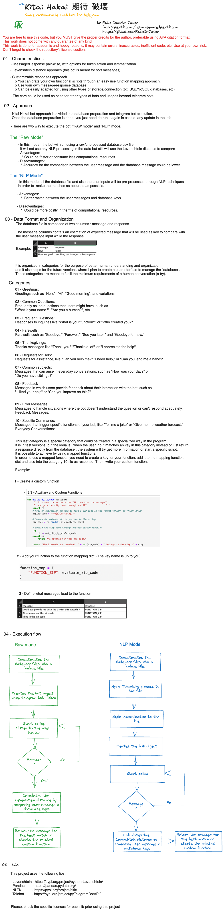

# Kitai
Kitai Hakai 期待 破壊 - Simple Customizable chat-bot for telegram

This is a personal project to create a chat-bot for Telegram based on Levenshtein's distance.
The beta version is functional and may contain bugs, feel free to use it and create your own telegram chat bot.

# Licensing 
> This project is licensed under the MIT license (at the moment)
> You can use it (at your own risk) including for commercial and non-commercial purposes or even use excerpts from it as long as you give due credit to the author and follow the license parameters.
> This is an ongoing project, and was made for academic and hobby purposes, without any type of guarantee, use at your own risk and don't forget to check the license's exemption from guarantees.

# Telebot Telegram
> This project uses the Telegram telebot library, to use it you must have a Telegram account and a valid Bot Token.
> Refer to the instructions for more information on how to get a bot token

# Files and source code.
> The chat bot source code is avaiable as a Jupyter notebook named Kitai_Hakai.ipynb
> In the folder "EN" you can find sample files generated by A.I. (chat GPT-4)  that can be used as example.
> The CSV files MUST be delimited by ";" instead of "," in order to prevent errors.
> Refer for the instructions section to understand better the file structure

# The Kitai Project 
## Instructions, Organization, and flow diagram.

